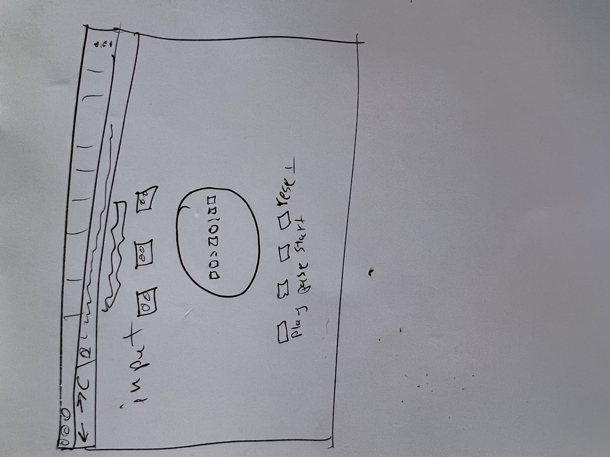

# Countdown Timer

## User Experience

The Countdown Timer is a user-friendly web-based application that provides users an interactive way to set and manage time for their tasks. It makes it easy for users to set, pause, resume, and reset a countdown.

## Design

### Colour Scheme

The application uses a minimal color palette with a blend of orange and midnight blue with white background for an appealing look.

### Typography

The primary typeface for the application is 'Electrolize', which provides a contemporary and sleek feel to the interface. In case 'Electrolize' fails to load or is not available, the default sans-serif font is used as a backup.

### Imagery

The circular progress bar serves as a visual indicator of the remaining time.

## Wireframes

## Features

### The Home Page

The home page is the main interface of the application. It displays a countdown timer, input fields for hours, minutes, and seconds, and four control buttons: start, pause, resume, and reset.

### Future Implementations

Future implementations could include multiple timers, timers with names or categories, and alarm sounds when time's up.

## Accessibility

The application is accessible to all users. All buttons have appropriate aria-label attributes for screen readers, and all input fields can be accessed via keyboard navigation.

## Technologies Used

### Languages Used

- HTML
- CSS
- JavaScript

### Frameworks, Libraries & Programs Used

1. **Circular progress bar:** This library was used to display a countdown timer. [Check out the library here.](https://github.com/webistomin/favoritos)

2. **Google Fonts:** Google Fonts was used to import the 'Electrolize' typeface into the style.css file. It's used throughout the project to ensure a consistent, attractive typography.

## Deployment & Local Development

### Deployment

The live website is hosted on GitHub pages and it can be accessed from [Your Favourite Countdown Timer](https://cairenea.github.io/p-p-2/).

Clone the repository to your local machine, then open `index.html` in a web browser to start the application.

### Local Development

To run this project locally, clone this repository and open `index.html` in any modern browser.

## How to Fork

1. In GitHub, navigate to the main page of the repository.
2. Click on the 'Fork' button in the upper right corner.

## How to Clone

1. Under the repository name, click 'Clone or download'.
2. In the Clone with HTTPs section, click to copy the clone URL for the repository.
3. Open Terminal.
4. Change the current working directory to the location where you want the cloned directory to be made.
5. Type `git clone`, and then paste the URL you copied.
6. Press Enter. Your local clone will be created.

## Testing

Please refer to the [TESTING.md](TESTING.md) file for details on all testing carried out.

### Solved Bugs

No  | Bug | Solution 
--- | --- | ---
1 | The alerts were preventing users from using only one of the three input fields (hours-minutes-seconds) from running the timer. | This issue was resolved by modifying the alert system to allow users to input the time into any of the three fields without triggering an alert. The system was adjusted to validate the time input as a whole rather than validating each individual field.
2 | The Start button could be pressed while the timer was already running, which caused the timer to crash. | This bug was fixed by disabling the Start button while the timer is running. This way, the timer couldn't be started again until it had been stopped or had finished counting down. This required adding a condition in the Start button event handler to check the status of the timer before proceeding.

## Credits

### Code Used

In this project, external libraries and code snippets were utilized to enhance its functionality and aesthetics:

1. **Google Fonts**: The 'Electrolize' font family was integrated into the project through Google Fonts. You can check it out [here](https://fonts.google.com/specimen/Electrolize).

2. **Favoritos Library**: For implementing the circular progress bar, the 'favoritos' JavaScript library was used. The repository can be found on [Github](https://github.com/webistomin/favoritos).

3. **Form Validation**: The application's form validation was implemented by referring to the tutorial available on [W3Schools](https://www.w3schools.com/js/js_validation.asp).

4. **Head Detached Issue Solution**: A common git issue encountered during the project was resolved with the help of this [Stack Overflow discussion](https://stackoverflow.com/questions/10228760/how-do-i-fix-a-git-detached-head).

5. **ASCII Calculator**: ASCII code references were used for character calculations. The reference can be found [here](https://www.ascii-code.com/characters/0-9).

### Content

All text content was written by the developer.

### Media

The following resources were instrumental in providing data and resolving issues during the development process:

**Color Palette:**

- [Colormind Bootstrap](http://colormind.io/bootstrap/)
- [Designs.ai Colors](https://designs.ai/colors/search/Spring)

**Contrast Checker:**

- [Siege Media Contrast Ratio](https://www.siegemedia.com/contrast-ratio#%23571179-on-%23fff)

## Acknowledgments

Thanks to Graeme and CI for providing guidance in the development of this project.
